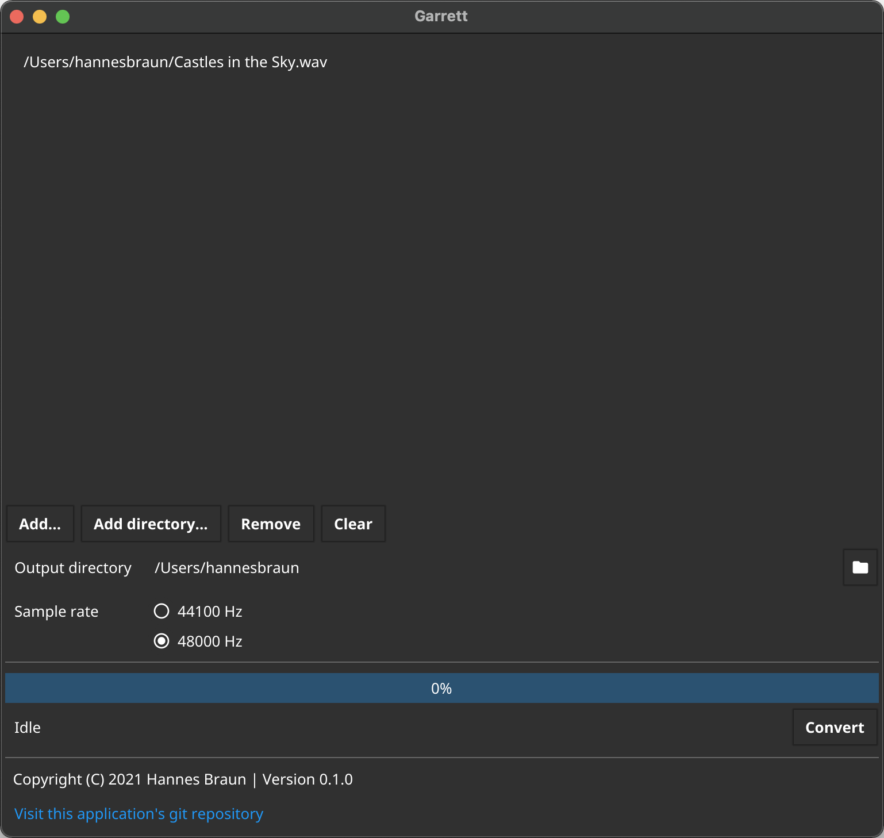

# Garrett

Another conversion tool for audio files (and you probably don't even need it)



## What does this software do?

If you have to ask this question, you're probably not the target audience ;)

Jokes aside. Garrett converts the given audio files into the "Waveform Audio File Format" (WAVE) with a static bit depth of 16 bits.
You can choose between two output sample rates: 44100 Hz and 48000 Hz.
The supported input formats are:
- WAVE
- MP3
- FLAC
- AIFF

## Why the hell is this application existing?

The purpose of this originally was to provide a simple conversion interface without needing a lot of knowledge behind the scenes.
The resulting audio files were primarily meant to be played on the x32 console from Behringer. However, this program can be used for other purposes too.

## Installation

For macOS and Linux, prebuilt binaries are available through [GitHub Releases](https://github.com/hannesbraun/garrett/releases).
It should also work with Windows. However, this is not tested, and you need to build it yourself.

### Building

Make sure to install the required dependencies. This is primarily `libsamplerate`. See the GitHub Actions workflow files for more details.

Install the Fyne utility with

```bash
go get fyne.io/fyne/v2/cmd/fyne
```

Then, package the application (in this example for macOS):

```bash
cd build/macos
bash build.sh 0.1.0
```

Replace `0.1.0` with the version number you're currently building.

## License

Garrett is licensed under the GNU General Public License v3.0. For more information see [LICENSE](LICENSE "GNU General Public License v3.0").

## Author

Hannes Braun (hannesbraun@mail.de)
